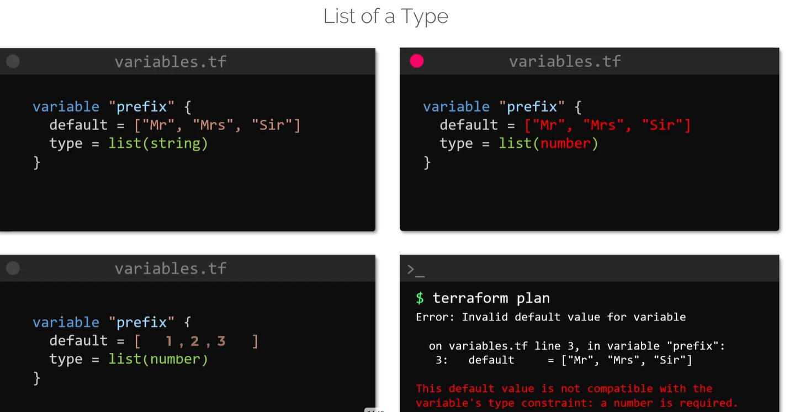
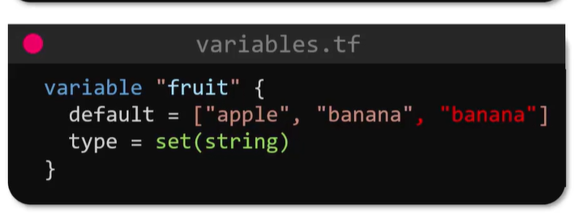
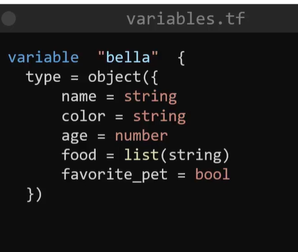
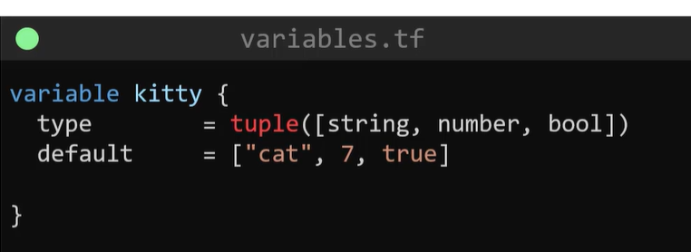

# List

Terraform lists are ordered collections of values. Access an item by its zero-based index.

```hcl
variable "prefix" {
	default = ["Mr", "Mrs", "Sir"]
	type    = list(string)
}

resource "random_pet" "my-pet" {
	prefix = var.prefix[0]
}
```

The list indexes are `0`, `1`, and `2`, so `var.prefix[0]` evaluates to `"Mr"`.





We are type constraints to validate the variables type.

set is variable type similar to list but set does not allow duplicate values in its fold.


we have directory that can use all variable types and tuples.

tuple can take any variable type compared to list can take only one type of variables.


Adding additional elements or incorrect type as varaible values will throw errors

***Note-1: filename and content are map keys, so they must be enclosed in double quotes.***

**Order of precedence

From lowest to highest priority:**

**1 Variable default values**

Defined inside variable blocks in .tf files.

**2 terraform.tfvars**

Automatically loaded variable file.

**3 terraform.tfvars.json**

Automatically loaded JSON variable file.

**4 *.auto.tfvars and *.auto.tfvars.json**

Automatically loaded files, in lexical filename order.

**5-var and -var-file command-line options**

Explicit values supplied when running Terraform. These have the highest priority; among repeated assignments, later values win.